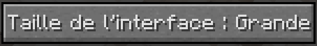

# 💡 Comment commencer ?


**Cette page est en cours d'écriture**&#x20;


## Télécharger le launcher :&#x20;

Pour télécharger notre launcher rien de plus simple que télécharger un fichier&#x20;

Pour Windows : [Télécharge ici ](https://radium-mc.ml/)

Pour Linux : [Télécharge ici](https://radium-mc.ml/)

Pour Mac : [Télécharge ici](https://radium-mc.ml/)

Lors que vous avez télécharger le launcher vous pouvez le lancer (si ce n'est pas déjà fait)

Puis vous allez avoir une page comme celle ci :&#x20;

Vous avez accès à de choix **Crack** ou **Microsoft**&#x20;

Si vous avez achetez **Minecraft** vous pouvez cliquer sur un des 2 cela ne change rien pour vous&#x20;

Mais si vous n'avais pas achetez **Minecraft** vous devez **obligatoirement** cliquer sur **Crack**

Si vous été en Crack vous allez voir cette page :&#x20;



Mettez simplement votre pseudo&#x20;

Vous pouvez lancer le jeu avec le bouton **Jouer**
